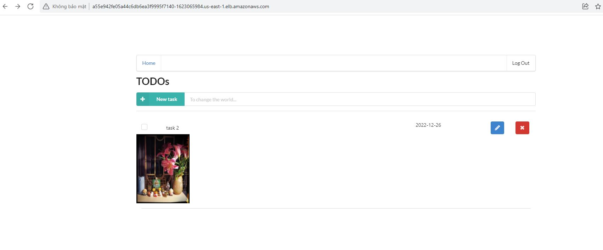

## Capstone project 

- Capstone poject is a serverless aplication reused and combined from project 4 with improvement using knowledge K8S from project 3 
- Backend: Apply CI/CD (Docker + Travis) to auto deploy changes
- Frontend: Apply CI/CD (Docker + Travis) to auto deploy changes, Using Kubenetes to deploy frontend from local to cloud

### TODO application frontend

URL: http://a55e942fe05a44c6db6ea3f9995f7140-1623065984.us-east-1.elb.amazonaws.com/

Web frontend is developed using ReactJS based on the TODO app from project 4
It is deployed using AWS EKS service
CI/CD pileline is applied (Travis and Docker) for automatical deployment

### TODO application backend
Lambda functions are automatically deployed using Travis CI
